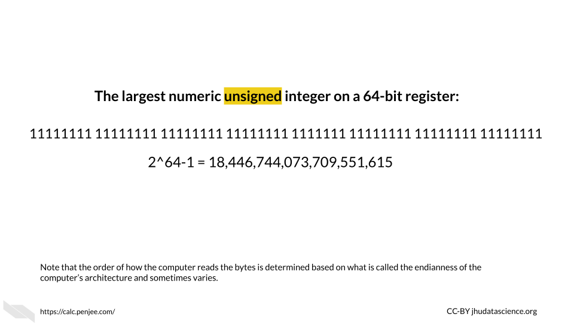

# Basic Building Block of Computers

First we would like to start off with some background information about how computers actually work (in this chapter and the next). We feel that this information, will be very helpful for understanding what computing resources your research will actually require. This information will also better enable you to discuss your computing needs with computing experts, for example people who manage shared computing resources that you might want to use. 

If you are already more familiar with these topics, we hope that the next two chapters might fill in possible knowledge gaps, point you to more resources, or at least provide some entertaining information regarding the history and future of computers that might change your perspective.

 

## Transistors

Luckily, you are likely not going to need to become a bee keeper to perform your computational research (unless of course that interests you)! Instead, computers rely on millions to billions of [transistors](https://www.physlink.com/education/askexperts/ae430.cfm) [@transistor_count].

[Transistors](https://www.physlink.com/education/askexperts/ae430.cfm) are one of if not the most important basic building blocks of computers. There are many different types of transistors, but they often look like a rectangle with three prongs [@how_transistors_work].  

[Transistors](https://technologystudent.com/elec1/transis1.htm) behave like electronic switches or gates that either allow or do not allow current to flow through a particular part of a circuit [@transistor_basics]. 

[[Source](https://unsplash.com/photos/9paY25EHOBo)]

Inside the plastic, is often [silicon](https://en.wikipedia.org/wiki/Silicon), or some other semiconductive crystal. Semiconductors materials are needed because they way that they conduct electricity can be modified by the application of more electricity, making them the perfect option for creating an electrical switch. Silicon is especially useful, because it doesn't cause the circuit to get very hot, unlike previously used materials. It is also very abundant, in fact, it is the second most common element of the Earth's crust! [@Wikipedia_Silicon].

If the transistor receives a small amount of current to one of the prongs (called the base), this turns it on, and allows the larger current for the circuit to pass through the transistor (from a prong called the collector to the prong called the emitter). 

If the base prong of the transistor does not receive a small current than the transistor is off and the current for the circuit is not allowed to flow through the transistor.

You may see how this is similar to ligand-gated ion or ionotropic channels in biological systems, where a channel remains closed and does not allow ions to pass through the membrane unless a ligand (like a neurotransmitter) binds to the channel protein, allowing the channel to open [@ligand-gated_2021; @ligand-gated_2011] and allowing ions to flow through the channel.

The two states for the flow of current ultimately allow for the storage and use of binary data, which we think of a zeros and ones, but it is really the absence or presence of current with a voltage beyond a threshold for this part of the circuit. 

Thus the physical components of a computer are ultimately based on the assessment of only two states of current (0 (or FALSE) = below a threshold and 1 (or TRUE) = above a threshold), which is much easier to create than if it we needed to assess more nuanced levels of current. It turns out that this binary encoding of current as digital data is the basis for all the complex tasks that we use computers for everyday.  

Very importantly transistors have gotten much smaller over time.

The **smaller** size of transistors has allowed for many more transistors to be used inside computers. Check out @transistor_count for more information about how the number of transistors in computers has grown over time. Early computers had thousands of transistors; now some supercomputers have trillions [@transistor_count]!

[[Source](https://commons.wikimedia.org/wiki/File:Moore%27s_Law_Transistor_Count_1971-2018.png)]

Both the **smaller size** of the transistors and the **increased number** of transistors have in part allowed computers to become faster and more powerful [@Pokropivny2007]. Thus transistors are a key reason why we have seen such an explosion of computing power and storage, which has facilitated what we have seen in the incredible expansion of data.

These silicon transistors became so important for the field of electronics, that the time period of heavy computing development during the late 20th century and early 21st century is sometimes called the "Silicon Age". This is also why many places in the world where there are many technological institutes are often called a name with the word "silicon", such as [Silicon Valley](https://en.wikipedia.org/wiki/Silicon_Valley) [@Wikipedia_silicon_2021]. Here is an interesting [article](https://futurism.com/could-mark-end-silicon-age) about what our next age might be about, and it has to do with changing the way we harness electrons (the current role of transistors) [@tom_ward_2017] --- that's how important they are!

If you would like to learn more about the history of transistors and how they work check out this [website](https://www.explainthatstuff.com/howtransistorswork.html) [@woodford_how_2007].

Finally, it is important to note that modern transistors have a 3D structure that allows them to be faster, more efficient, and more densely packed because now circuits can be layered in 3D structures, thus allowing for even more transistors to be included within modern computers [@finfet_2021].

## ALU - Arithmetic Logic Unit

The ALU is responsible for performing simple operations by using networks (in this case commonly called a circuit) of transistors. 

These simple operations include logical operations (AND, OR, NOT, etc.), and arithmetic operations (addition, subtraction, division, multiplication, etc.).  

Ultimately most of what we do everyday on our computers comes down to these simple operations.

These operations are based on what is called [Boolean logic or Boolean algebra](https://en.wikipedia.org/wiki/Boolean_algebra), which was invented by George Boole in 1854 and largely comes down to thinking of possible sets of data [@explainthatstuff; @Wikipedia_boolean_2021]. For example, if we have two transistors, they could both be on, they could both be off, or one or the other could be on. Considering these possibilities, we can make overall descriptions about the flow of current to perform logical operations.
 
Let's take a moment to understand how networks of transistors work for AND and OR operations. We call a network for a logical operation a **logic gate** [@Wikipedia_logic_gate_2021]. Note that this is a simple illustration and in actual electronics, additional transistors are often used for greater sustainability, consistency, efficiency, and speed, largely based on controlling the level of current and voltage in more nuanced ways.

In this illustration of the transistor [AND gate](https://en.wikipedia.org/wiki/AND_gate), there are two transistors where the current going to the collector for each transistor is in series. This means the transistors are sequentially placed one after the other, where one receives current first before the other. A resulting high current output only occurs when both of the transistors allow for the flow of current. If either transistor is off or both of the transistors are off, then the current is not allowed to flow through, and the resulting digital output is zero [@Wikipedia_AND_gate_and_2021]. 

In our next simple illustration, the transistor OR gate has two transistors in parallel, meaning they are next to one another each receiving the flow of current at the same time. A resulting high current output can occur when either of the transistors allows for the flow of current [@Wikipedia_OR_gate_2021].

 

Importantly, using more complex arrangements of these logic gates can allow the computer to perform the arithmetic operations [@Wikipedia_adder_2021]. See [here](http://homepage.divms.uiowa.edu/~jones/assem/notes/08arith.shtml) and [here](https://en.wikipedia.org/wiki/Adder_(electronics)) for more information on how this works.

For example, to calculate the sum of 1 plus 1 we would need what is called a ["full adder"](https://en.wikipedia.org/wiki/Adder_(electronics)) which can be made a few ways but generally contains several logic gates that check the current status of the digits of the values being added. For example, part of an adder might check using logic if the first digit of the first number is the same as that of the second number to be summed with the first.  Recall that each of these gates would be made up of multiple transistors, thus many transistors would be required even for adding 1 and 1. For larger numbers we would need more full adders [@wiki_adder_2022; @adder_binary_2013]. Thus You can see how the need for many transistors adds up quickly! To better understand how this is possible, we need to first talk about how computers use the two binary states of current to represent numeric values. In other words, we need to talk about binary data.

If you would like to learn more about these logic gates with circuit diagrams, check out this [website](http://hyperphysics.phy-astr.gsu.edu/hbase/Electronic/trangate.html#c1) and this [website](https://www.cs.bu.edu/~best/courses/modules/Transistors2Gates/) for some visualizations. This [website](https://www.explainthatstuff.com/logicgates.html) and this [website](https://www.electronics-tutorials.ws/logic/logic_1.html) also go into great detail.

In case you are wondering about the semantics of phrases like the "flow of current", check this [discussion](https://electronics.stackexchange.com/questions/61780/isnt-current-flow-a-wrong-term).

### Binary data

An ALU performs arithmetic operations using values represented in binary digits called bits (0 or 1) (recall that this is based on a state of current). Data like this is also called [Boolean](https://en.wikipedia.org/wiki/Boolean_algebra),  based on George Boole system of algebra. These values do not mean their typical meanings from what we know numerically, but instead follow arithmetic rules using 2 as the base, as opposed to 10 which we are familiar with for our decimal system. What does this mean?
With our decimal system when we reach a value of 10, we start to carry over the 1. With the binary system when we reach a value of 2, we start to carry over the 1 [@Wikipedia_boolean_2021].

Here we can see how the first 9 digits of the decimal system are represented in the binary system.

Now taking this a step deeper, we can see how addition works with binary data.

See [here](https://www.calculator.net/binary-calculator.html) to learn more about binary calculations [@binary_calc].

 
This optional [video](https://www.youtube.com/watch?v=VBDoT8o4q00)explains further how transistors are used to add numbers together.

### Flip-flops and registers

Flip-flops are used for storing one bit of digital binary data. They are made of transistors (that's right it's transistors again!) and capacitors in a configuration that allows for the flip-flop to hold one of two states, thus enabling the storage of binary data [@Wikipedia_flip-flop_2021; @Wikipedia_memory_2021].

A group of flip-flops is called a register [@Wikipedia_register_2021]. You may have heard about a computer having a 64- or 32- bit operating system (more on this soon). These computers have registers with 64 bits or 32 bits respectively. Thus there are 64 flip-flops within the registers of a [64-bit](https://www.computerhope.com/jargon/num/64bit.htm) system [@ComputerHope_64-bit]. Each of these are capable of storing and processing binary values 64 digits in length (which works out to an unsigned integer in our decimal system of up to 2^64-1, or 18,446,744,073,709,551,615)[@ComputerHope_64-bit]! 

You may also be wondering how letters and other symbols are stored in this binary system. 

Letters are each assigned a numeric decimal value according to an encoding system such as the [ASCII system](https://www.computerhope.com/jargon/a/ascii.htm), and these are converted into the binary form of this numeric number. 

Below you can see the decimal value for some of the symbols and letters:

In the ASCII system, this ultimately works out to letters being stored by a standard 8 binary digits (or bits) [@Wikipedia_ascii_2021]. A group of 8 bits (8 digits of zeros and or ones) is called a byte [@computerhope]. Since this is consistent, this works well with computers that have registers that can store in sets of 8 bits. In fact, that is indeed how most computers work today. The "64-bit" part of what is called a 64-bit computer indicates what is called the [word size or word length](https://en.wikipedia.org/wiki/Word_(computer_architecture)), which is the maximum unit of data that the computer can work with at a time [@Wikipedia_word_length_2021]. This means that it can process binary numbers of up to 64 digits in length. Since 64 divided by 8 is 8, this means for a 64-bit computer, each register could store up to 64 bits or binary digits and thus can store 8 binary bytes. Note that it is possible to combine registers to make  computations with larger numbers. Since each letters or symbol is encode by a byte (8 bits), this means up to 8 letters or symbols can be stored by a single register at a time. Other computers may work with a 32-bit word size, meaning that the registers can accommodate only 4 bytes at a time or 32 binary digits. As you might guess 64-bit computers are more capable of faster speeds and greater precision (by giving more decimal places) when computing operations with values that are larger than 32 binary digits, as compared to such operations using a 32-bit computer.

Note that ASCII has largely been replaced since 1991 for [Unicode](https://en.wikipedia.org/wiki/Unicode), which allows for more characters, supporting languages like Chinese that require far more characters than the 256 that ASCII could support [@Wikipedia_unicode_2021]. However Unicode works in a similar way[@Wikipedia_unicode_2021].

Keep in mind that ALUs can only work with binary data. All different types of data like letters, words, numbers, code, etc. ultimately get encoded as 0s and 1s first for the computer to work with and after the computations are made, the computer then translates the data back to numeric and alphabetic form for us to understand. Thus computers do a lot of data conversions!

Here's a great video that puts everything we have explained so far together:

<iframe src="https://www.youtube.com/embed/Xpk67YzOn5w" width="100%" height="400px"></iframe>

Again, if you want to watch another [video](https://www.youtube.com/watch?v=VBDoT8o4q00), this optional video that we told you about earlier explains how transistors are used to add numbers together. In this video you will see that many transistors (and several logic gates) are needed to even do a simple calculation of 1 + 1. You also learn that more complicated summations just require more transistors arranged in a similar manner. 

## Conclusion

We hope that this chapter has given you some more knowledge about how computers are physically made.

In conclusion, here are some of the major take-home messages:

1) Computers rely on millions to billions of tiny transistors
2) Transistors act like electrical switches that allow for the storage and processing of digital binary data
3) Binary data is essentially the encoding of current states in the hardware of a computer as zeros and ones
4) As transistors got smaller and more transistors were included in computers, computers got faster and more powerful (also due to other additional reasons)

