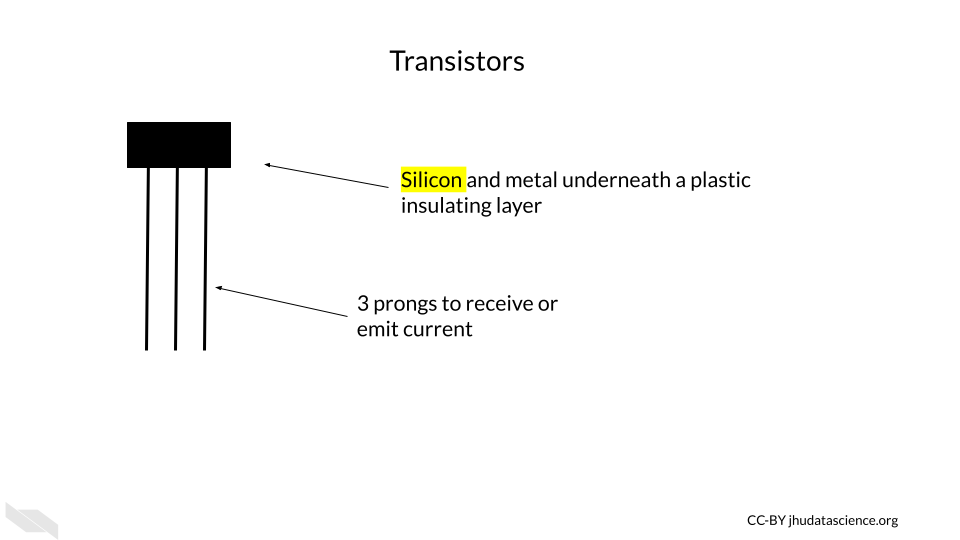

# The basic building block of computers

First we would like to start off with some background information about how computers actually work. We feel that this information, that we will describe in this chapter and the next, will be very helpful for understanding what computing resources your research will actually require. This information will also better enable you to discuss your computing needs with computing experts, for example people who manage shared computing resources that you might want to use. 

If you are already more familiar with these topics, we hope that the next two chapters might fill in possible knowledge gaps, point you to more resources, or at least provide some entertaining information regarding the history and future of computers that might change your perspective.

 

## Computing Components

Luckily, you are likely not going to need to become a bee keeper to perform your computational research (unless of course that interests you)! Instead, computers rely on millions to billions of [transistors](https://technologystudent.com/elec1/transis1.htm).

### Transistors

[Transistors](https://www.physlink.com/education/askexperts/ae430.cfm) are one of if not the most important basic building blocks of computers. There are many different types of transistors, but they often look like a rectangle with three prongs.  

[Transistors](https://technologystudent.com/elec1/transis1.htm) behave like electronic switches or gates that either allow or do not allow current to flow through a particular part of a circuit. 

[[Source](https://unsplash.com/photos/9paY25EHOBo)]

Inside the plastic, is often [silicon](https://en.wikipedia.org/wiki/Silicon), or some other semiconductive crystal. Semiconductors materials are needed because they way that they conduct electricity can be modified by the application of more electricity, making them the perfect option for creating an electrical switch. Silicon is especially useful, because it doesn't cause the circuit to get very hot, unlike previously used materials. It is also very abundant, in fact, it is the second most common element of the Earth's crust! [@Wikipedia_Silicon]).

If the transistor receives a small amount of current to one of the prongs (called the base), this turns it on, and allows the larger current for the circuit to pass through the transistor (from a prong called the collector to the prong called the emitter). 

If the base prong of the transistor does not receive a small current than the transistor is off and the current for the circuit is not allowed to flow through the transistor.

These two states for the flow of current ultimately allow for the storage and use of binary data, which we think of a zeros and ones, but it is really the absence or presence of current with a voltage beyond a threshold for this part of the circuit. 

Thus the physical components of a computer are ultimately based on the assessment of only two states of current (0 (or FALSE) = below a threshold and 1 (or TRUE) = above a threshold), which is much easier to create than if it we needed to assess more nuanced levels of current. It turns out that this binary encoding of current as digital data is the basis for all the complex tasks that we use computers for everyday.  

Very importantly transistors have gotten much smaller over time.

The **smaller** size of transistors has allowed for many more transistors to be used inside computers. Check out @transistor_count for more information about how the number of transistors in computers has grown over time. Early computers had thousands of transistors; now some supercomputers have trillions [@transistor_count]!

[[Source](https://commons.wikimedia.org/wiki/File:Moore%27s_Law_Transistor_Count_1971-2018.png)]

Both the **smaller size** of the transistors and the **increased number** of transistors have in part allowed computers to become faster and more powerful [@Pokropivny2007]. Thus transistors are a key reason why we have seen such an explosion of computing power and storage, which has facilitated what we have seen in the incredible expansion of data.

These silicon transistors became so important for the field of electronics, that the time period of heavy computing development during the late 20th century and early 21st century is sometimes called the "Silicon Age". This is also why many places in the world where there are many technological institutes are often called a name with the word "silicon", such as [Silicon Valley](https://en.wikipedia.org/wiki/Silicon_Valley). Here is an interesting [article](https://futurism.com/could-mark-end-silicon-age) about what our next age might be about, and it has to do with changing the way we harness electrons (the current role of transistors) --- that's how important they are!

If you would like to learn more about the history of transistors and how they work check out this [website](https://www.explainthatstuff.com/howtransistorswork.html).

## Conclusion

We hope that this chapter has given you some more knowledge about how computers are physically made.

In conclusion, here are some of the major take-home messages:

1) Computers rely on millions to billions of tiny transistors
2) Transistors act like electrical switches that allow for the storage and processing of digital binary data
3) Binary data is essentially the encoding of current states in the hardware of a computer as zeros and ones
4) As transistors got smaller and more transistors were included in computers, computers got faster and more powerful (also due to other additional reasons)

