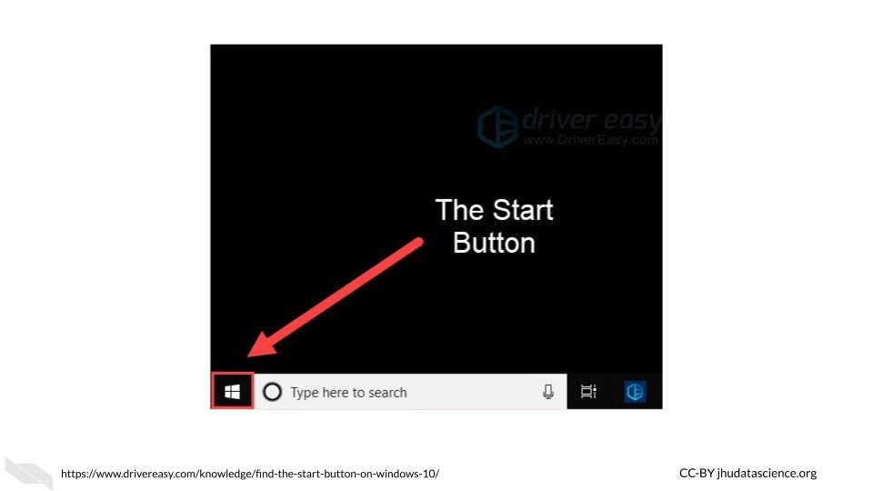
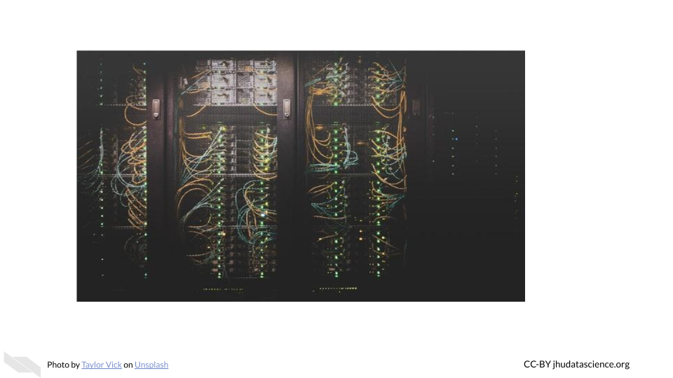

# Computing Systems

In this chapter we will describe the basics about data size and computing capacity. We will discuss the computing and storage requirements for many types of cancer related data, as well as options to perform informatics work that might require more intensive computing capacity than your personal computer.

## Data Sizes

Recall that the smallest unit of data is a bit which is either a zero or a one. A group of 8 bits is called a byte, and most computers and phones, and software programs are constructed or designed in a way to accommodate groups of bytes at a time. For example a 32-bit machine can work with 4 bytes at a time and a 64-bit can work with 8 bytes at a time. But how big is a file that is 2 GB? When we sequence a genome, how large is that in terms of binary data? Can our local computer work with the size of data that we would like to work with?

First let's take a look at how the size of binary data is typically described and what this actually means in terms of bits and bytes:

Now that we know how to describe binary data sizes, let's next think about how much computing capacity typical computers have today.

## Computing Capacity

Now that we know about the CPU, how many tasks can the CPU of an average computer do these days? How much memory and storage do they typically have? What size of files can a typical computer handle? This information is sometimes called the **specs** of a computer.

These values will probably change very soon, and different computers vary widely, but currently:

* **Laptops** can often perform 4-8 CPU tasks at once, and typically range from 4-16 GB in memory and 250 GB-1 TB of storage. 

This means that typical laptops can multitask quite well, have in some cases 16 gigabytes for random access memory to allow the CPU to work on relatively large tasks (as we can see from the previous table that GB are actually pretty large when you think about it), and possibly 1TB for the hard drive (and or SSD), meaning that you can store thousands of photos and files like PDFs, word documents etc. It turns out that you can store around 30,000 average size photos with 250GB, so a 1TB laptop can store quite a bit of data. Therefore overall, typical laptops today are pretty powerful compared to previous computers. Note that some programs require 16 or even 32 GB of memory to run.

* **Desktops** can perform and store similarly and sometimes to a degree better than a laptop for a similar price.  Since less work needs to be done to make the desktop small and portable, sometimes you can get better storage and performance for the same price as a laptop. However, desktops often have better graphics processing capacity and displays and that might make up for the price difference. In fact, some such desktops may be the same price as a laptop but have much lower computing and storage capacity due to higher GPU capacity. Focusing on GPUs as well might be important to consider if you are going to need to visually inspect many images. Another benefit is that you can also sometimes find more expensive desktops with larger memory and storage options off the shelf than typical laptops. It is also generally easier to add more memory to a desktop than it is to add to a laptop. However of course, they certainly aren't super portable!

* Some **phones** can compete with laptops by performing 6 CPU tasks at once and storing 6 GB in memory and 250 GB of storage.  

Check out this [link](https://www.apple.com/mac/compare/?modelList=iMac,MacBook-Pro-14,MacBook-Pro-16-2021) to compare the prices of different macs and this [link](https://www.hp.com/us-en/shop/slp/weekly-deals) to compare specs for PC computers from HP. 

If you want to get really in-depth comparisons for PC or windows machines, check out this [link](https://www.userbenchmark.com/PCBuilder/Custom/S0-M1487712vsS0-M?tab=RAM).

https://www.businessinsider.com/laptops-vs-desktops-2018-8#for-most-laptops-youre-stuck-with-their-specs-until-its-time-to-upgrade-to-a-new-model-desktops-can-be-upgraded-pretty-easily-3

potentially suggest this book: https://play.google.com/store/books/details?id=sP0vEAAAQBAJ&rdid=book-sP0vEAAAQBAJ&rdot=1&source=gbs_vpt_read&pcampaignid=books_booksearch_viewport

### Checking your computer capacity - Mac
So what about your computer? How do you know how many cores it has or how much memory and storage it has?

If you have a Mac, you can click on the apple symbol on the far left of your screen. Then click on the "About This Mac" button.

You might see something like this:

First we see the operating system is called Mojave.
Next we see that the processor (which we now know is the CPU) is a 2.6 GigaHertz (GHz) Intel Core i7 chip. This means that the processor or CPU can process 2,600,000,000 operations in a second (this is called a clock cycle). That's a lot!
If we look up more about this chip we would learn that it has 4 cores  and has hyper-threading, which allows it to  effectively perform 8 tasks at once.
Next we see that there is 16 Gigabytes of memory - this is how much RAM it has and also 2133 MegaHertz of low power double data rate random access memory (LPDDR3), this means that the CPU can complete one operation with the RAM 2,133,000,000 times every second.

If we click on the Storage button at the top, we can learn about how much storage is available on the computer. If you hover over a section, it tells you what file are accounting for that section of storage that is already being used.

### Checking your computer capacity - Windows/PC

If you have a PC or Windows computer, the steps may vary depending on your operating system, but try the following:

1. click the "Start" button - which looks like 4 squares together
2. click "Settings" button (gear-shaped)
3. click "System"
4. click "About"

See this [link](https://www.businessinsider.com/how-to-find-computer-specs-windows-10) for more information.

Here we can see that this computer has an Intel(R) Core(TM) i7-4790K CPU @ 4.00 GHz 4.00 GHz chip and 16 Gigabytes of RAM.
If we look up this chip we can see that it has 4 cores and 8 threads (due to hyper-threading) allowing for 8 tasks at a time. 

To find out more information about your storage click the "Storage" button within the "System" tab.

Here we can see that this computer has 466 GB + 465 GB = 932 GB across the two drives. The C drive is typically for the operating system, and the D drive is typically where you would install application programs and save files. There are 1000 GB in a TB, thus, this computer has about the same storage as the Mac that we just looked at.

## File Sizes

Now let's think about the files that we might need for our research, how big are files typically for genomic, imaging, and clinical research?

Recall this table from earlier about digital data size units:

### Genomic data file sizes

Genomic data files can be quite large and can require quite a bit of storage and processing power.

Here is an image of sizes of common file types:

- proteomics
- methylation
- human and mouse...

### Imaging Data File Sizes

Imaging data, although often smaller than genomic data, can start to add up quickly with more images and samples.

Here is an image of average file sizes for various medical imaging modalities:

[[source](https://www.mdpi.com/2078-2489/8/4/131)]

### Clinical Data File Sizes

metabolomics?

### Checking file sizes on Mac

If you own a Mac and want to check the size of a particular file, look at your file within a finder window. You can open a new finder window by clicking on the button that looks like a square with two colors and a face, typically in the bottom left corner if your dock or the strip of icons on your screen to help you navigate to different application programs.

Once you open a finder window, you can navigate to one of your files. 

If you have the view setting that looks like 4 lines, you will get information about the size of each file. 

You can right click on  a file and click the "Get Info" button. This will give your more specific information.

### Checking file sizes on PC/Windows

In a similar manner to checking file sizes on a Mac, with a Windows or PC computer, you can navigate to files by first opening the File Explorer application by typing this in the search bar next to the "start" button.

Then navigate to a file of interest which will show information about the size in one of the columns to the right, if you hover over the file name, you will get more specific information.

## Computing Options

### **Personal computers**

These are computers that your lab might own, such as a laptop, a desktop, used by one individual or maybe just a few individuals in your lab.  

If you are not performing intensive computational tasks, it is possible that you will only need personal computers for your lab. However, you may find that this changes, and you might require connecting your personal computers to shared computers for more computational power and or storage.

### **Shared Computers or Servers**

What if you decide that you do need more computational power than your personal computer? You may encounter times where certain informatics tasks take way too long or are not even possible. Evaluating the potential file sizes of the data that you might be working with is a good place to start. However, keep in mind that sometimes certain computations may require more memory than you expect. This is particularly true when working with genomic or image files which are often compressed. So what can you do when you face this issue?

One great option, which can be quite affordable is using a server.

In terms of hardware, the term [server](https://techterms.com/definition/server) means a computer (often a computer that has much more storage and computing capacity than a typical computer) or groups of computers that can be accessed through a direct local network or the internet to perform computations or store data.  They are often shared by people, and allow users to perform more intensive computational tasks or store large amounts of data. Read [here](https://en.wikipedia.org/wiki/Server_(computing)) to learn more. 

For example, your lab members could connect to a server from their own computers to allow each of them more computational power. Typically computers that act as servers are set up a bit differently than our personal computers, as they do not need the same functionality and are designed to optimize data storage and computational power. For instance they often don't have capabilities to support a [graphical user interface](https://www.omnisci.com/technical-glossary/graphical-user-interface)(meaning the visual display output that you see on your personal computer). 

Instead they are typically only accessed by using a [command-line interface](https://en.wikipedia.org/wiki/Command-line_interface, meaning that users write code instead of using buttons like they might for a program like Microsoft Word that uses a graphical user interface. In order to support this they have memory, processors or CPUs, and storage like your laptop.

Here is what a server might look like:

 In this case we have a group of computers making up this server. Here we see the nodes (the individual computers that make up the server) stacked in columns. 

Among shared computers/servers there are three major options: 

* **Clusters** - institutional or national resources
* **Grids** - institutional or national resources
* **Cloud** - commercial or national resources

### [Computer Cluster](https://en.wikipedia.org/wiki/Computer_cluster)

In a computing cluster several of the **same** type of computer (often in close proximity and connected by a local area network rather than the internet) work together to perform pieces of the same single task simultaneously. The idea of performing multiple computations simultaneously is called [parallel computing](https://en.wikipedia.org/wiki/Parallel_computing).

There are different designs or architectures for clusters. One common one is the [Beowulf cluster](https://en.wikipedia.org/wiki/Beowulf_cluster) in which a master computer (called front node or server node) breaks a task up into small pieces that the other computers (called **client nodes** or simply **nodes**) perform. 

For example, if a large file needs to be converted to a different format, **pieces** of the file will be converted simultaneously by the different nodes. Thus each node is performing the **same task** just with different pieces of the file. The user has to write code in a special way to specify that they want parallel processing to be used and how. 

It is important to realize that the CPUs in each of the node computers connected within a cluster are all performing a similar task simultaneously.

See [here](https://cs.wmich.edu/~elise/courses/cs626/s09/hussein/Parallel_and_Cluster_Computing.pdf) for more information.

### [Computer Grid](https://hazelcast.com/glossary/grid-computing/)

In a computing grid **different** types of computers (often in different locations) work towards an overall common goal by performing **different** tasks. 

The concept for grid computing is similar to that of an [electric power grid](https://en.wikipedia.org/wiki/Electrical_grid), where only computers (nodes) actively performing a task are using resources at any given time. 

Again, just like computer clusters, there are many types of architectures that can be rather simple to very complex. For example you can think of different universities collaborating to perform different computations for the same project. One university might perform computations using gene expression data about a particular population, while another performs computations using data from another population. Importantly each of these universities might use clusters to perform their specific task.

Both grids and clusters use a special type of software called middleware to coordinate the various computers involved.
Users need to write their scripts in a way that can be performed by multiple computers simultaneously. Users also need to be conscious of how to schedule their tasks and to follow the rules and etiquette of the specific cluster or grid that they are sharing (more on that soon!). 

See [here](https://pediaa.com/difference-between-cluster-and-grid-computing/) for more information about the difference between clusters and grids.
 
 
AVOCADO maybe add as a reference https://ieeexplore.ieee.org/stamp/stamp.jsp?tp=&arnumber=1300502

https://www.geeksforgeeks.org/difference-between-grid-computing-and-cluster-computing/

3) ["Cloud" computing](https://en.wikipedia.org/wiki/Cloud_computing)] 

More recently, ["Cloud"](https://en.wikipedia.org/wiki/Cloud_computing) solutions are becoming a more viable hardware solution, offered by companies like Amazon, Google, and Microsoft, as well as through government funding projects. This option is technically also a shared computer situation. **Somewhere these companies have clusters of computers that paying customers use through the internet.** However, in this case **multiple servers** are connected to one another to create the "Cloud". This allows for even more computational dependability, as even if one or multiple servers is down, you can often still use the other servers for your computations. In addition to the commercial options, there are national resource options like Jetstream which is a more "Cloud-like" part of Xsede.

AVOCADO need a new shared computer image and more about Jetstream which I think is a good option for many people
https://go.cloudhealthtech.com/eb-simplify-the-journey-data-center-to-public-cloud.html

### Accessing Shared Computer Resources

It's important to remember that all of the shared computing options that we previously described involve a [data center](https://en.wikipedia.org/wiki/Data_center) where are large number of computers are physically housed. 

You may have access to a [HPC (which stands for High Performance Computing) cluster](https://www.hpc.iastate.edu/guides/introduction-to-hpc-clusters/what-is-an-hpc-cluster) at your institute. This can be a great cost effective and typically secure option.  

If your university or institution has a HPC [cluster](https://en.wikipedia.org/wiki/Computer_cluster), this means that they have a group of computers acting like servers that people can use to store data or assist with intensive computations. Often institutions can support the cost of many computers within an HPC cluster. This means that multiple computers will simultaneously perform different parts of the computing required for a given task, thus significantly speeding up the process compared to you trying to perform the task on just your computer! This is also a much more cost effective option than having one expensive supercomputer (a computer that individually has the computational power of many personal computers) to act as a server. It turns out that buying several less powerful computers is cheaper. In some cases however, an institute might even have a sever with multiple supercomputers!

If your institute doesn't have a shared computing resource like the HPCs we just described, you could also consider a national resource option like [Xsede](https://www.xsede.org/).
[Xsede](https://www.xsede.org/) is led by the University of Illinois National Center for Supercomputing Applications (NCSA) and includes 18 other partnering institutions (which are mostly other universities). Through this partnership, they currently support 16 supercomputers. Universities and non-profit researchers in the United States can request access to their computational and data storage resources.

Here you can see a photo of Stampede2, one of the supercomputers that members of Xsede can utilize.

[[source](https://www.xsede.org/ecosystem/resources)]

> Stampede2, generously funded by the National Science Foundation (NSF) through award ACI-1134872, is one of the Texas Advanced Computing Center (TACC), University of Texas at Austin's flagship supercomputers.

See [here](https://portal.xsede.org/tacc-stampede2) for more information about how you could possibly connect to and utilize Stampede2.

Importantly when you use shared computers like national resources like Stampede2 available through Xsede, as well as institutional HPC clusters, you will share these resources with many other people and so you need to learn the proper etiquette for using and sharing these resources. We will discuss this more in a coming chapter.

We will also discuss how these options might differ from cloud computing options. Importantly there are some that have been especially designed for scientists and specific types of researchers, so it is also useful to know about these options.

## Conclusion

We hope that this chapter has given you some more perspective on how large medical research data files can be, as well as more familiarity with how well your computer might be able to accommodate the files that you might work with. We also hope that this chapter has provided you with some more awareness about computing options that might be available to you, should you need more capacity than your current computer. 

In conclusion, here are some of the major take-home messages:

1) A bit is the smallest binary digital data unit. It is a single 0 or 1.
2) A byte is a group of 8 bits, file sizes are typically described using units based on bytes.
3) A typical fancy laptop today might allow for up to 1 TB of storage, however this can quickly get used up if you are working with large data files. 
4) Even if you have enough storage for a large file, you might not have enough RAM to actually work with a large data file. Your computer might be too slow to handle that type of work. AVOCADO - want to say more about this
5) A server (when describing hardware) is a single computer (typically a supercomputer if just one computer) or group of computers that others can share to help them  perform more intensive computational tasks or store large amounts of data. People often connect to these over the internet, but servers can also be connected to by directly using wires in a local network (like in a department to different offices). 
6) The computers in a server  are optimized for assisting users with computations or storing data.
7) A supercomputer is a computer that has much more storage, memory, and computing capacity than a typical personal computer. Supercomputers are generally much more expensive than using a group of more typical computers that together would have the same collective computing and storage capacity. Avocado need to add this in the content!
8) There are two general types of servers: clusters and grids. Cluster approaches work by having several computers working on pieces of the same task simultaneously in a method called parallel computing. Grid approaches work by having different types of computers working on different tasks. 
9) Cloud computing is essentially the use of many servers through some company or institute. This is often more reliable because there are many servers to use, even if one other users are performing large tasks or if a server goes down. 
10) If your institute doesn't allow you to access a shared computing resource, you could consider options like [Xsede](https://www.xsede.org/), which is a national resource that you can request access to or some of the other options that we will describe next.

AVOCADO - add image about clusters and grids 

