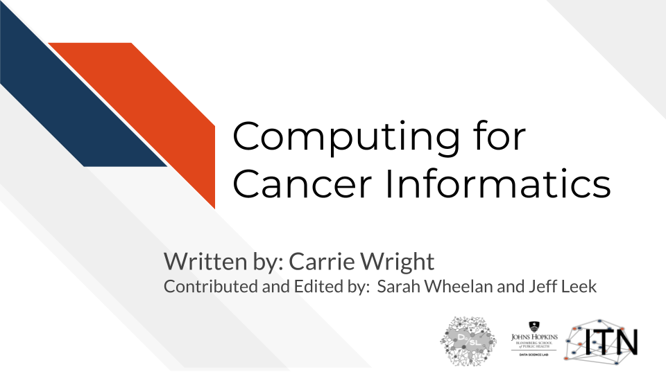
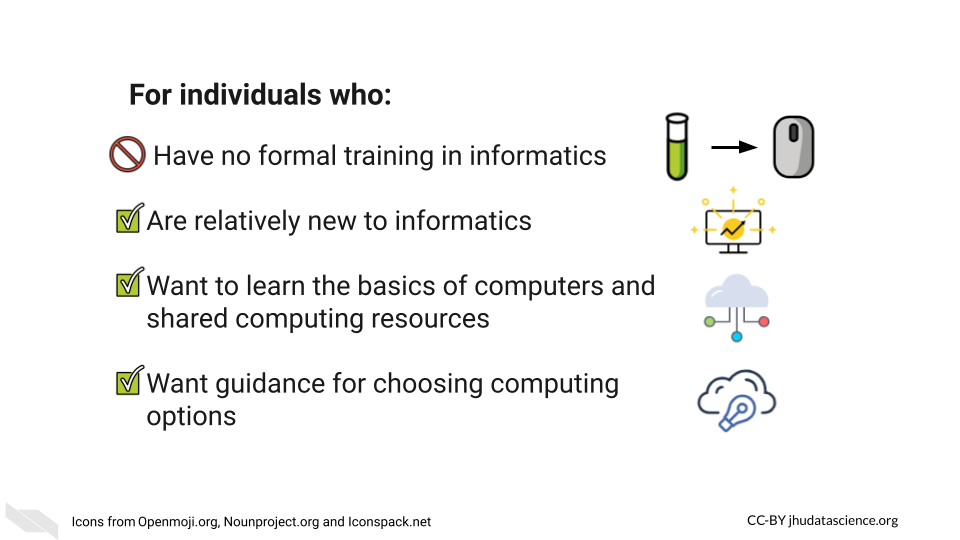

# Introduction

## Motivation

One of the key challenges in cancer informatics is dealing with and managing the explosion of large data from multiple sources that are often too large to work with on typical personal computers. This course is designed to help researchers and investigators understand the basics of computing and to familiarize them with various computing options, ultimately helping their research decisions.

## Target Audience

This course is intended for researchers, including postdocs and students, with limited to intermediate experience with informatics research. The conceptual material will also be useful for those in management roles who are collecting data and using informatics pipelines.

## Topics covered:

## Curriculum

The course will cover key underlying principles and concepts in computing. We will go over concrete discussions of the differences between cloud and local computing. The course will also highlight a number of computing options and describe etiquette basics for using shared resources.

